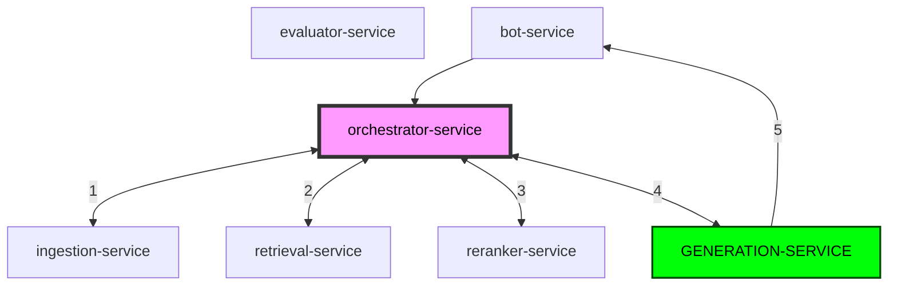

# INGESTION-SERVICE 
- Сервис для работы с документами, их загрузка и хранение в S3, а также сохранение metadata документов

```mermaid
graph TD
    K[evaluator-service]
    
    
    F[bot-service] --> c[orchestrator-service]  
    c <--1--> B[ingestion-service] 
    c <--2--> G[retrieval-service]
    c <--3--> E[reranker-service]
    c <--4--> I[GENERATION-SERVICE]
    I --5--> F
    
    
    style c fill:#f9f,stroke:#333,stroke-width:4px,color:#000
    style I fill:#00ff08,stroke:#014a04,stroke-width:2px,color:#000
```
